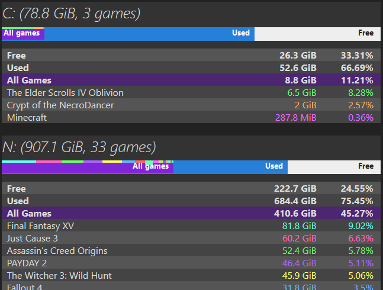

# Steam Overview v1.2

*(Ignore the choppy row colours. GIFs are weird.)*

A toolkit for easy overview of your Steam games and how much space in your drive they take.

[Download], extract and run `Steam Overview.py` (requires [Python] > 3.6); after scanning the results will appear in your browser.

## Update log
- **1.2: Added animated tutorial, refactored code.**
- 1.1: Quality-of-life tweaks and bugfixes.
- 1.0: Initial release.

[Download]: https://github.com/yunruse/Steam-Overview/archive/master.zip "Steam-Overview-master.zip"
[Python]: https://www.python.org/downloads/ "Python download site"

